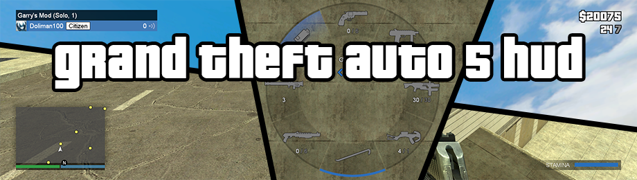
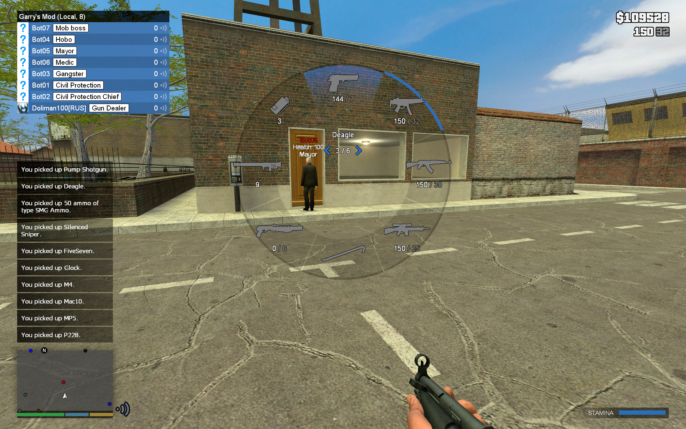
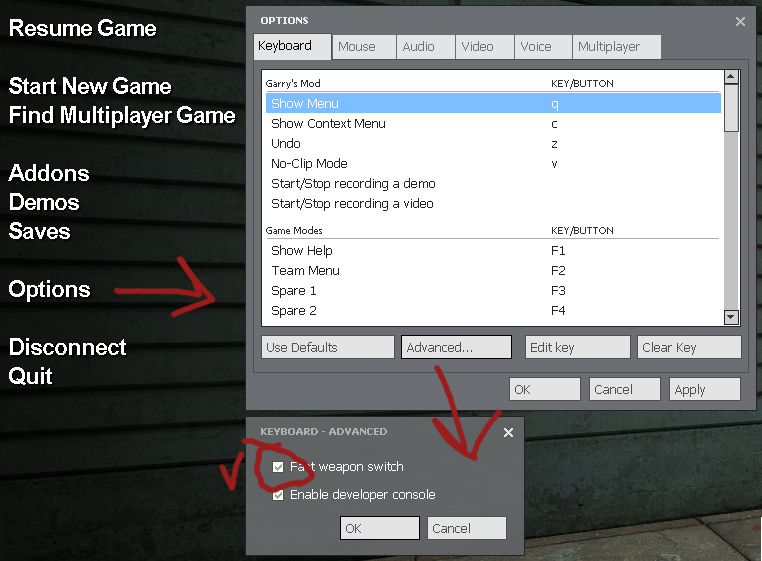
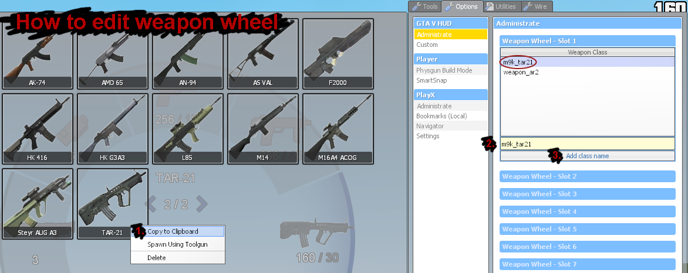

# Grand Theft Auto V HUD

Grand Theft Auto V HUD for Garry's Mod. It has preferences for both administrator and players. It work in single player and with any gamemode. It has special features for DarkRP (show money). You can disable any element of the hud. You do not need to download the content, because it is in workshop.

### Content
* Materials
* Fonts
* Sounds

Available at Steam Workshop https://steamcommunity.com/sharedfiles/filedetails/?id=514740282.

### Feautures

* Radar (blips, notifications, voice icon, health, armor, hunger)
* Info (money, ammo)
* Weapon wheel (default B)
* Deathscreen
* Scoreboard
* Stamina bar

### Player preferences
* Weapon wheel key
* Weapon wheel sensivity
* Safezone size
* Notice max
* Notice duration
* Notice apperance
* Notice stack on/off

Click "Update" to apply

### Administrator preferences
* Weapon wheel slots
* Radar distance
* Radar distance safe
* Radar show/hide
* Notices show right
* Scoreboard show/hide
* Scoreboard hroup show/hide
* Deathscreen show/hide
* Weaponwheel show/hide
* Info show/hide
* Money show/hide
* Hunger show/hide
* Stamina show/hide

Click "Update" to save

### Mods supported
* Hunger Mod
* Stamina Bar

### Gamemodes supported
* DarkRP
* Sandbox
* Others

## FAQ

### Installation
Extract "gta5hud" folder to "<Garry's Mod>/garrysmod/addons/"

### How to disable default darkrp scoreboard
http://wiki.darkrp.com/index.php/LUA:Remove_FAdmin

### How to disable default weapon selector

### How to edit weapon wheel

1. Open spawn menu (default Q)
1. Go to tab "Options"
1. Go to option "Administrate" in "GTA V HUD"
1. Unfold category "Weapon Wheel - Slot X"
1. Enter class name in input (You can find class name in spawn menu tab "Weapons". Click RMB on weapon. In context menu select "Copy to Clipboard".)
1. Click "Add class name"

### How to add blips
1. Put your blip set to "garrysmod/materials/"  
*"garrysmod/materials/shop.png"*
1. Open file "garrysmod/addons/gta5hud/lua/gta5hud/blips.lua" in notepad.
   * To add a blip at coordinates, add the line `GTAV:AddBlip(string material, number width, number height, number x, number y)`  
*`GTAV:AddBlip("shop.png", 24, 24, 280, -1290)`*
   * To add a blip to a class, add the line `GTAV:AddBlipClass(string material, number width, number height, string class)`  
*`GTAV:AddBlipClass("prop.png", 24, 24, "prop_physics")`*

A blip set is not included to the addon content. You may try to manually extract them from the original Grand Theft Auto V game using OpenIV (for example http://i.imgur.com/gksAiYC.png).
